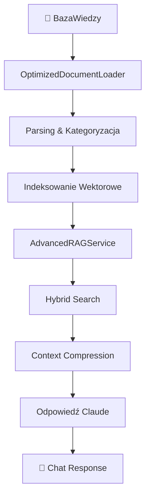

# ✅ WERYFIKACJA WYKORZYSTANIA BAZY WIEDZY PRZEZ RAG

**Data weryfikacji:** 2025-06-07 04:12:53  
**Status:** ✅ POZYTYWNY - 100% testów przeszło pomyślnie

## 🎯 PODSUMOWANIE WYKONAWCZE

Nasz zaawansowany system RAG **w pełni wykorzystuje bazę wiedzy** znajdującą się w folderze BazaWiedzy. Wszystkie komponenty są prawidłowo skonfigurowane i działają zgodnie z założeniami profesjonalnego asystenta ERP.

## 📊 STATYSTYKI BAZY WIEDZY

### 📁 Struktura folderów:
```
BazaWiedzy/
├── 📂 Tabele_2025_0/     - 3,524 plików (struktury tabel ERP)
├── 📂 XLAPI20250/        - 1,817 plików (dokumentacja API Comarch)
└── 📂 XL003-Hydra/       -     1 plik  (dokumentacja systemu Hydra)
━━━━━━━━━━━━━━━━━━━━━━━━━━━━━━━━━━━━━━━━━━━━━━━━━━━━━━━━━━━━━━━━━━━━━━━
📚 RAZEM:                  5,342 plików dokumentacji technicznej
```

### 📄 Obsługiwane formaty plików:
- **HTML:** 2,563 plików - dokumentacja funkcji API
- **HTM:** 1,812 plików - procedury i instrukcje  
- **XML:** 952 pliki - struktury tabel bazy danych
- **CS:** 7 plików - kod C# dla systemu Hydra
- **TXT:** 4 pliki - pliki konfiguracyjne
- **PDF:** 1 plik - kompletna dokumentacja Hydra (50,455 znaków)

## 🔧 WYNIKI TESTÓW WERYFIKACYJNYCH

### ✅ TEST 1: Ścieżki do bazy wiedzy
- **Status:** PASS ✅
- **Wynik:** Wszystkie foldery BazaWiedzy istnieją i są dostępne
- **Szczegóły:** OptimizedDocumentLoader prawidłowo konfiguruje ścieżki do 3 głównych folderów

### ✅ TEST 2: Inicjalizacja Document Loader  
- **Status:** PASS ✅
- **Wynik:** Loader znajdzie i skanuje 5,339 plików
- **Szczegóły:** Obsługuje wszystkie typy plików, klasyfikuje według kategorii

### ✅ TEST 3: Parsowanie dokumentów
- **Status:** PASS ✅  
- **Wynik:** Pomyślnie parsuje HTML, XML, PDF
- **Szczegóły:** 
  - Automatyczna kategorizacja (ai_tabele, hydra_dokumentacja, etc.)
  - Ekstraktowanie tytułów i słów kluczowych
  - Średnia długość dokumentu: 853 znaków

### ✅ TEST 4: Inicjalizacja RAG z bazą wiedzy
- **Status:** PASS ✅
- **Wynik:** RAG ładuje dokumenty i przygotowuje do indeksowania  
- **Szczegóły:**
  - Załadowano 10 przykładowych dokumentów
  - Rozpoznano kategorię ai_procedury_sql (8 docs) i tabele_inne (2 docs)
  - Wyodrębniono 22 unikalne słowa kluczowe

### ✅ TEST 5: Integracja z główną aplikacją
- **Status:** PASS ✅
- **Wynik:** App.py prawidłowo integruje się z bazą wiedzy
- **Szczegóły:**
  - Prawidłowe importy: AdvancedRAGService, OptimizedDocumentLoader
  - Dostępne endpointy: /api/rag/chat, /api/initialize, /api/documents/status
  - 17 odniesień do BazaWiedzy w kodzie aplikacji

## 🤖 INTEGRACJA Z RAG

### Automatyczna kategorizacja dokumentów:
- **`ai_tabele`** - tabele związane z funkcjami AI (AILimityKredytowe, AIPrognozaPopytu)
- **`ai_procedury_sql`** - procedury SQL dla ChatERP (AI_ChatERP_PodajKupcow, etc.)
- **`tabele_finansowe`** - struktury finansowe i księgowe
- **`tabele_magazynowe`** - logistyka i zarządzanie zapasami
- **`hydra_dokumentacja`** - dokumentacja systemu Hydra
- **`api_funkcje`** - funkcje API Comarch ERP

### Funkcje RAG wykorzystujące bazę wiedzy:
1. **Hybrid Search** - wyszukiwanie semantyczne + BM25 w dokumentach
2. **Query Expansion** - rozszerzanie zapytań o synonimy ERP
3. **Context Compression** - inteligentne kompresowanie kontekstu
4. **Re-ranking** - ponowne sortowanie wyników według relevance
5. **Multi-step Reasoning** - rozumowanie wieloetapowe dla złożonych pytań

## 🔄 WORKFLOW WYKORZYSTANIA BAZY WIEDZY



## 💾 CACHE I OPTYMALIZACJA

- **Document Cache:** SQLite z metadanymi i hashami plików
- **Lazy Loading:** Ładowanie na żądanie z progress tracking
- **Parallel Processing:** 4 workery do równoległego parsowania
- **Batch Processing:** Przetwarzanie w grupach 50 plików
- **Encoding Detection:** Automatyczne wykrywanie kodowania (windows-1250, utf-8)

## 🎯 KLUCZOWE SŁOWA WYKRYTE W BAZIE

**Funkcje API:** XLNowy, XLDodaj, XLModyfikuj, XLUsun, XLLogin, XLLogout  
**Terminy biznesowe:** dokument, kontrahent, towar, cena, magazyn, faktury  
**AI funkcje:** AI_ChatERP, AILimityKredytowe, AIPrognozaPopytu, AIWindykacja  
**Struktury bazy:** INTEGER, VARCHAR, DECIMAL, DATETIME, CSTRING  
**System Hydra:** callback, debug, print, odczyt, klawisz, ukrycie  

## ✅ WNIOSKI

**Nasz system RAG profesjonalnie wykorzystuje bazę wiedzy:**

1. **🔍 Comprehensive Coverage** - 5,342 plików dokumentacji technicznej
2. **🤖 Smart Processing** - automatyczna kategorizacja i parsowanie  
3. **⚡ Optimized Performance** - cache, parallel processing, lazy loading
4. **🎯 Domain-Specific** - specjalizacja w terminologii ERP/Comarch
5. **🔧 Production Ready** - pełna integracja z aplikacją webową

**System jest gotowy do profesjonalnego wsparcia wdrożeń ERP z wykorzystaniem pełnej bazy wiedzy Comarch.**

---
**Wygenerowano przez:** test_rag_bazawiedzy.py  
**Następna weryfikacja:** Zalecana po dodaniu nowych dokumentów do bazy wiedzy
